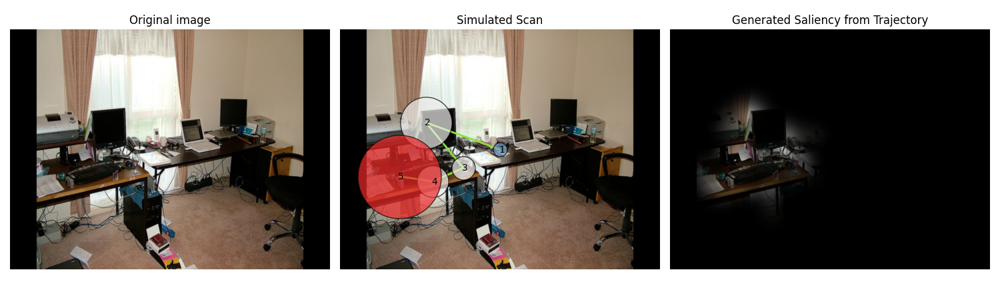

# Using Langevin Monte Carlo to Generate Gaze Trajectories (Simulation and Evaluation)

This project allows simulating gaze trajectories using algorithms like ULA and MALA, and evaluating the performance using trajectory comparison methods such as ScanMatch (SM) and MultiMatch (MM). It can be used to generate and evaluate simulated gaze on an image dataset.



## Project Structure

The project includes several modules:

- **evaluation.py**: Contains the `evaluation_pipeline_N` function to evaluate the algorithm's performance on a set of images of the COCOSearch18 dataset, specifically images with observations with more than 2 fixations.
- **run_algorithms.py**: Contains the `run_algorithm` function to run a simulation algorithm on a single image.
- **saliency_to_potential.py**: Contains functions to transform saliency maps into potential maps.
- **zs_clip_seg.py**: A module to generate saliency maps using the CLIPSeg model.

## Requirements

Before running the code, ensure that all required dependencies are installed. You can do this by running:

    pip install -r requirements.txt

The `requirements.txt` file includes necessary packages like `numpy`, `matplotlib`, `torch`, and others.

## How to Use the Main Script

The `main.py` script performs two main tasks depending on the selected mode:

1. **Run an algorithm on a single image** (commented out in the code).
2. **Simulate a defined number of gaze trajectories, run an algorithm, and calculate performance statistics on a validation image set**.

### Steps to Run the Script

1. **Set the input variables:**
   In the code, modify the following variables to configure the image path, task, and image name:
   ```python
   input_dir = "COCOSearch18-images-TP/images/"
   task = "keyboard"
   output_dir = f"output/images/{task}"
   name = "000000006608.jpg"

Choose the algorithm to use: Select the simulation algorithm to use (e.g., ULA or MALA) by modifying the algorithm variable:

    algorithm = 'ula'  # or 'mala'

Set model parameters (optional): If you are using the MALA-Cauchy algorithm, you can set the gamma parameter:

    gamma = 0.1   #Used only in MALA-Cauchy

Type of execution:

    Type 1: Run the algorithm on a single image (this part is commented out in the code).
    Type 2: Simulate a defined number of scanpaths (e.g., 10), run the algorithm, and calculate performance statistics.

For Type 2, the code in main() is already set up:

    evaluation_pipeline_N(n, algorithm, gamma)

Run the script: Execute the script to start the simulation and evaluate the results. Make sure that the main.py file is properly configured and that the input images are in the correct path.

To run the script, simply execute:

    python main.py

Algorithm Overview

The algorithm simulates gaze trajectories on an image using a potential map derived from saliency maps. The simulated trajectories are compared with human scanpaths using metrics like ScanMatch (SM) and MultiMatch (MM) to calculate performance.
Description of Modules:

    evaluation_pipeline_N(n, algorithm, gamma) # Runs the evaluation on N simulated scanpaths for each image in the validation set. It calculates the performance using MM and SM metrics.
    run_algorithm(input_dir, output_dir, task, name, algorithm, gamma) # Runs the chosen algorithm on a single image, simulates the gaze trajectory, and returns the fixations.
    saliency_to_potential.py # Transforms saliency maps into potential maps to guide Langevin algorithms.
    zs_clip_seg.py # Generates saliency maps using the CLIPSeg model.